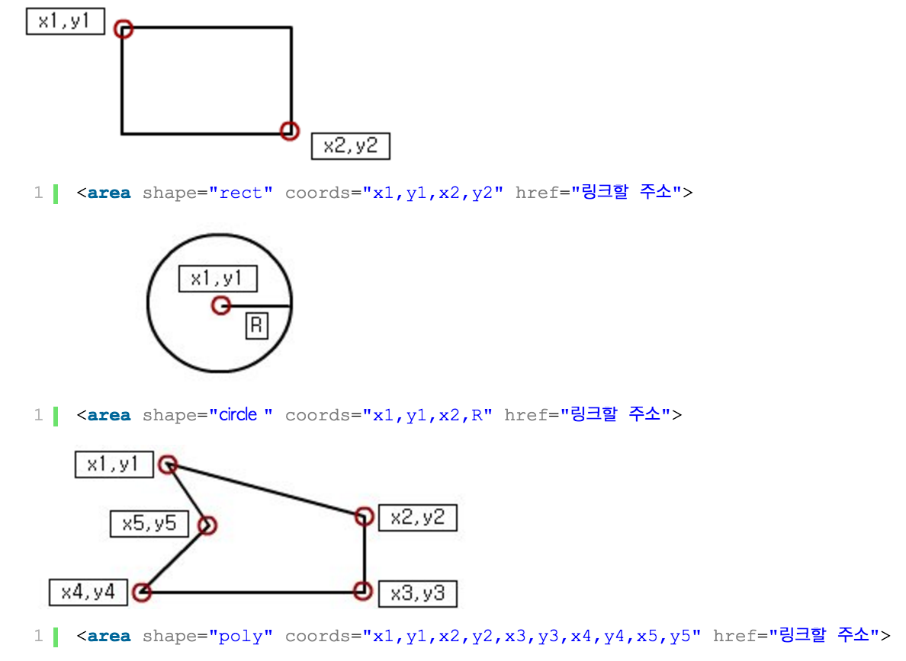

## DAY 03 - FDS

#### HTML 이미지  

* `src`, `alt` 속성은 필수적으로 입력해야 한다.
* 'alt'속성의 경우 정확한 설명을 제공해야 하는데, 그 이유는 시각 장애인이 사용하는 스크린 리더 소프트웨어와 검색 엔진이 인식하기 때문이다. 
* `width`, `height` 속성은 필수적으로 입력해야 하진 않지만, 입력하는 것을 권장한다(좋은 사용자 경험을 위해)
```

```

#### HTML 이미지맵  

* 이미지에 연결할 맵을 설정할 경우, usemap 속성을 사용한다.(`<map>`요소의 name 속성 이름 앞에 #을 붙인다.)
* usemap에 map의 id 값을 입력해준다.(주의할 점: img의 usemap값과 map태그의 id값이 같아야 한다.)  

```html


<map id="image-map" name="maps">
  <!-- [사각형, Rectangle]: 왼쪽 상단 좌표와 우측 하단 좌표를 이용하여 직사각형 영역을 지정 -->
  <area shape="rect" coords="x1,y1,x2,y2" href="링크1" alt="링크1 설명">
  <!-- [원, Circle]: 중심(Center) 좌표와 반지름(Radius)을 이용하여 원 영역을 지정 -->
  <area shape="cir" coords="center-x,center-y,radius" href="링크2" alt="링크2 설명">
  <!-- [다각형, Polygon]: (X,Y) 좌표들로 이루어진 임의의 다각형 영역을 지정 -->
  <area shape="poly" coords="x1,y1,x2,y2,x3,y3,x4,y4" href="링크3" alt="링크3 설명">

</map>  
```

  

_출처: [이미지맵](http://cracode.tistory.com/14)_


#### 테이블(Table)  

###### border-collapse  

* `<table>`테그만을 가지고 표를 만들경우에는 셀과 셀 사이에 선이 굵어 모양이 좋지 않다. 그 때 border-collapse의 collapse속성을 사용하게 되면, 셀간의 간격이 합쳐진다.
* 이 경우, 셀 사이의 선이 없어졌기 때문에 내용을 구분하기 어려워, border에 속성값을 줘서 선을 추가해주어야 한다. 
* 표 제목을 사용할 경우, WAI-ARIA보다 `<caption>`방식이 우선된다.
* `<th>`요소에 `scope`속성을 사용해 열 제목인지, 행 제목인지를 설정하면 접근성을 향상시킬 수 있다.
* 웹 브라우저 렌더링 시에 `<thead>`, `<tfoot>`으로 감싼 영역이 없다면, 나머지 `<tr>`영역을 `<tbody>`로 자동으로 감싸게 된다.  


속성|설명
---|---
colspan| 열(column)을 병합한다.
rowspan| 행(row)을 병합한다.  


#### HTML 목록
+ 순차 목록(Ordered List : ol)
+ 비순차 목록(Unordered List : ul)
+ 정의 목록(Definition List)  
  * 각 `<li>`요소들은 부모가 되는 `<ol>`,`<ul>`요소로부터 `life-style` 속성값을 상속받는다.
  * `<ol>`,`<ul>`요소 내부에 `<li>`요소를 제외한 다른 요소가 내부에 들어오게 되면 문법 오류가 된다.
  * `<navigation>`을 제작할 경우 목록이 많이 사용되는데 이 때 `<li>`내부에 `<a>`요소를 위치시켜 탭포커스가 적용되도록 설정하여 접근성을 향상시켜준다.  

#### HTML FORM(폼)  

```html
<!-- action: 데이터를 보낼 곳, 메서드: 보내는 방식 -->
<form action="/register.php" method="POST" name="register_form" enctype="multipart/form-data">
    <!-- input 요소에 암묵적 레이블 연결, 일부 스크린리더는 읽지 못하므로 권장하지 않음 -->
    <!-- <label>ID: <input type="text"></label> -->

    <!-- input 요소에 명시적 레이블 연결: for 속성과 id 속성이 연결 된다. -->
    <!-- id 속성은 접근성, name 속성은 서버에 값을 전송할 경우, 필요하므로 둘 다 기입한다. -->
    <label for="user_id">ID</label>: <input type="text" id="user_id" name="user_id">
    <button type="submit">전송</button>
</form>
```

#### `<blockquote>`  

* `<blockquote>`요소는 전체 단락을 차지하는 긴 인용에 사용한다.
* `<q>`요소는 단락 내에서 짧은 인용에 사용한다.
  * 두 요소는 인용의 출처를 밝히기 위해 `<cite>`속성을 사용하기도 한다.  

```html
<blockquote cite="출처 url">
  <p>스티브잡스의 대표적 명언</p>
</blockquote>  

<p><q>Stay foolish</q></p>
```